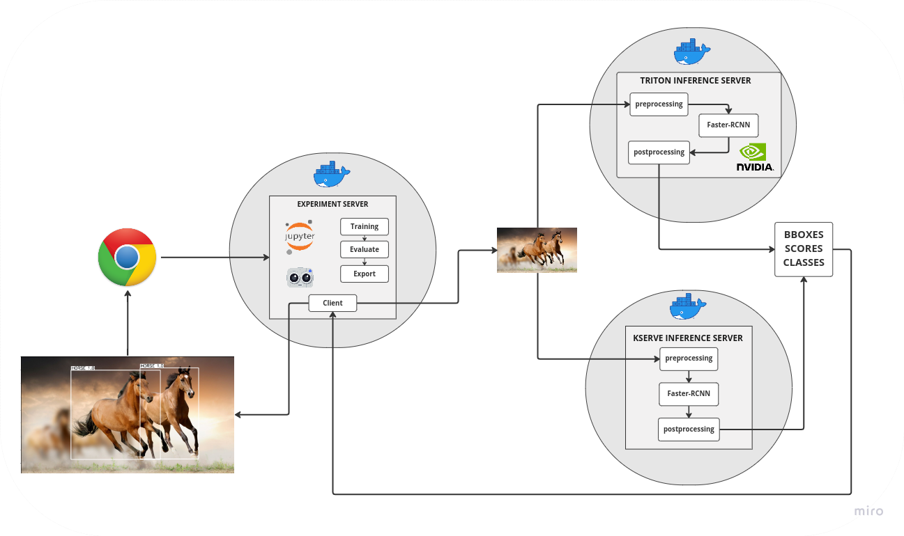

##  Обучение и деплой модели детекции с помощью NVIDIA Triton Inference Server и KServe


## Описание

В этом проекте реализовано три сервиса:
- **jupyter** - обучение, валидация и экспорт модели детекции + клиент для инференс сервисов.
- **triton** - инференс готовой модели детекции через [NVIDIA Triton Inference Server](https://developer.nvidia.com/nvidia-triton-inference-server).
- **kserve** - инференс готовой модели детекции через [KServe](https://github.com/kserve/kserve).

### Блокноты
- [Обучение, валидация и экспорт модели детекции](https://github.com/PitKoro/SberCloudTestTask/blob/main/jupyter/notebooks/train.ipynb)
- [Пример инференса обученной модели](https://github.com/PitKoro/SberCloudTestTask/blob/main/jupyter/notebooks/inference.ipynb)
- [Тест инференса модели в NVIDIA Triton Inference Server](https://github.com/PitKoro/SberCloudTestTask/blob/main/jupyter/notebooks/client_for_triton.ipynb)
- [Тест инференса модели в kserve](https://github.com/PitKoro/SberCloudTestTask/blob/main/jupyter/notebooks/client_for_kserve.ipynb)

Запуск **tensorboard** во время обучения находится в блокноте с обучением.

### Вспомогательные скрипты
- [`show_dataset.py`](https://github.com/PitKoro/SberCloudTestTask/blob/main/jupyter/src/show_dataset.py) - просмотр датасета в COCO формате с помощью [FiftyOne](https://docs.voxel51.com/).
- [`client.py`](https://github.com/PitKoro/SberCloudTestTask/blob/main/jupyter/src/client.py) - измерение среднего времени обработки запроса в NVIDIA Triton.
- [`export_model.py`](https://github.com/PitKoro/SberCloudTestTask/blob/main/jupyter/src/export_model.py) - экспорт обученной модели в формат torchscript.


## Как запустить

1. Поставить [nvidia-docker и nvidia-docker2](https://docs.nvidia.com/datacenter/cloud-native/container-toolkit/install-guide.html)
2. Запустить скрипт для загрузки весов:

```shell
sh download_weights.sh
```

3. Запуск через docker-compose

```shell
docker compose up --build
```

## Тесты
### NVIDIA Triton Inference Server
В браузере пройти по локальному адресу `http://127.0.0.1:8888/lab/tree/notebooks/client_for_triton.ipynb` и выполнить подряд ячейки:
- Единичный запрос и визуализация результата.
- Запуск скрипта на 100 запросов к серверу инференса.

### KServe
  В браузере пройти по локальному адресу `http://127.0.0.1:8888/lab/tree/notebooks/client_for_kserve.ipynb` и выполнить подряд ячейки

### Обучение, оценка и инференс модели детекции
- Обучение и оценка - `http://127.0.0.1:8888/lab/tree/notebooks/train.ipynb`
- Инференс detectron2 - `http://127.0.0.1:8888/lab/tree/notebooks/inference.ipynb`
